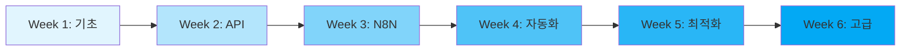

# 📚 블로그 자동화 스터디 - 6주 완성 커리큘럼

> **목표**: YouTube 콘텐츠를 활용한 블로그 자동화 시스템을 단계별로 학습하고 구축하기
> 
> **기간**: 6주 (주 10-15시간 학습 기준)
> 
> **최종 목표**: 3-4시간 작업을 5분으로 단축하는 95% 자동화 달성

## 🎯 학습 목표

### 핵심 역량
- ✅ N8N 워크플로우 자동화 마스터
- ✅ API 통합 및 관리 능력
- ✅ 콘텐츠 자동 생성 시스템 구축
- ✅ 모니터링 및 최적화 기술
- ✅ 트러블슈팅 및 디버깅 능력

### 학습 후 구현 가능한 것들
- YouTube → Blog 자동 변환 파이프라인
- 멀티 플랫폼 동시 발행 시스템
- AI 기반 콘텐츠 최적화
- 성과 모니터링 대시보드
- 확장 가능한 자동화 아키텍처

## 📖 커리큘럼 개요



## 📅 주차별 상세 커리큘럼

### 🔷 Week 1: 기초 다지기
**학습 목표**: 자동화 개념 이해 및 환경 구축

| 일차 | 주제 | 학습 내용 | 실습 |
|------|------|----------|------|
| Day 1 | 자동화 개요 | • 워크플로우 자동화란?<br>• 왜 N8N인가?<br>• OPAL vs N8N 비교 | 자동화 가능 업무 리스트업 |
| Day 2 | 환경 설정 | • Docker 설치 및 이해<br>• Git 기초<br>• VS Code 설정 | Docker Hello World |
| Day 3 | 기초 도구 | • REST API 개념<br>• JSON 이해<br>• HTTP 메소드 | Postman으로 API 테스트 |
| Day 4 | 프로젝트 구조 | • 프로젝트 아키텍처<br>• 데이터 흐름 설계<br>• 시스템 요구사항 | 아키텍처 다이어그램 작성 |
| Day 5 | 실습 & 복습 | • Week 1 종합 실습<br>• 트러블슈팅 | 미니 프로젝트 |

**📚 학습 자료**: [Week 1 상세 가이드](./week1-basics/README.md)

### 🔷 Week 2: API 마스터하기
**학습 목표**: 필요한 모든 API 이해 및 연동

| 일차 | 주제 | 학습 내용 | 실습 |
|------|------|----------|------|
| Day 1 | YouTube API | • API 키 발급<br>• 주요 엔드포인트<br>• Rate Limiting | 비디오 정보 추출 |
| Day 2 | OpenAI API | • GPT-4 API 이해<br>• 프롬프트 엔지니어링<br>• 토큰 관리 | 콘텐츠 생성 테스트 |
| Day 3 | WordPress API | • REST API 활성화<br>• 인증 방식<br>• CRUD 작업 | 포스트 자동 발행 |
| Day 4 | Instagram API | • Graph API 설정<br>• 미디어 업로드<br>• 해시태그 전략 | 이미지 포스팅 |
| Day 5 | API 통합 | • 에러 핸들링<br>• 재시도 로직<br>• 보안 관리 | 통합 테스트 |

**📚 학습 자료**: [Week 2 상세 가이드](./week2-api/README.md)

### 🔷 Week 3: N8N 심화 학습
**학습 목표**: N8N 워크플로우 구축 능력 습득

| 일차 | 주제 | 학습 내용 | 실습 |
|------|------|----------|------|
| Day 1 | N8N 기초 | • 노드 개념<br>• 워크플로우 구조<br>• 트리거 유형 | 첫 워크플로우 |
| Day 2 | 데이터 처리 | • 데이터 변환<br>• 필터링<br>• 조건 분기 | 데이터 파이프라인 |
| Day 3 | 고급 노드 | • Function 노드<br>• Loop 처리<br>• 병렬 처리 | 복잡한 로직 구현 |
| Day 4 | 에러 처리 | • Try-Catch 패턴<br>• 에러 알림<br>• 복구 전략 | 견고한 워크플로우 |
| Day 5 | 실전 구축 | • YouTube→Blog 워크플로우<br>• 테스트 & 디버깅 | 전체 파이프라인 |

**📚 학습 자료**: [Week 3 상세 가이드](./week3-n8n/README.md)

### 🔷 Week 4: 자동화 구현
**학습 목표**: 실제 자동화 시스템 구축

| 일차 | 주제 | 학습 내용 | 실습 |
|------|------|----------|------|
| Day 1 | 콘텐츠 수집 | • YouTube 모니터링<br>• RSS 피드<br>• 웹 스크래핑 | 자동 수집 시스템 |
| Day 2 | AI 콘텐츠 생성 | • 프롬프트 최적화<br>• 다국어 지원<br>• SEO 최적화 | 콘텐츠 생성기 |
| Day 3 | 멀티 플랫폼 | • 동시 발행<br>• 플랫폼별 최적화<br>• 스케줄링 | 배포 자동화 |
| Day 4 | 데이터베이스 | • PostgreSQL 연동<br>• 데이터 저장<br>• 분석 준비 | DB 스키마 설계 |
| Day 5 | 통합 테스트 | • E2E 테스트<br>• 성능 측정<br>• 버그 수정 | 시스템 검증 |

**📚 학습 자료**: [Week 4 상세 가이드](./week4-automation/README.md)

### 🔷 Week 5: 최적화 & 모니터링
**학습 목표**: 성능 최적화 및 모니터링 구축

| 일차 | 주제 | 학습 내용 | 실습 |
|------|------|----------|------|
| Day 1 | 성능 최적화 | • 병목 구간 찾기<br>• 캐싱 전략<br>• 비동기 처리 | 속도 개선 |
| Day 2 | 모니터링 설정 | • Grafana 대시보드<br>• 알림 설정<br>• 로그 관리 | 대시보드 구축 |
| Day 3 | 비용 최적화 | • API 사용량 관리<br>• 리소스 최적화<br>• 비용 분석 | 비용 절감 |
| Day 4 | 품질 관리 | • 콘텐츠 품질 체크<br>• A/B 테스트<br>• 사용자 피드백 | 품질 시스템 |
| Day 5 | 보안 강화 | • API 키 관리<br>• 접근 제어<br>• 백업 전략 | 보안 점검 |

**📚 학습 자료**: [Week 5 상세 가이드](./week5-optimization/README.md)

### 🔷 Week 6: 고급 기능 & 확장
**학습 목표**: 시스템 확장 및 고급 기능 구현

| 일차 | 주제 | 학습 내용 | 실습 |
|------|------|----------|------|
| Day 1 | 머신러닝 통합 | • 콘텐츠 분류<br>• 추천 시스템<br>• 감정 분석 | ML 파이프라인 |
| Day 2 | 커스텀 통합 | • 커스텀 노드 개발<br>• 외부 서비스 연동<br>• Webhook 활용 | 커스텀 기능 |
| Day 3 | 스케일링 | • 부하 분산<br>• 큐 시스템<br>• 마이크로서비스 | 확장 가능 설계 |
| Day 4 | CI/CD | • 자동 배포<br>• 테스트 자동화<br>• 버전 관리 | 배포 파이프라인 |
| Day 5 | 최종 프로젝트 | • 전체 시스템 구축<br>• 문서화<br>• 발표 준비 | 포트폴리오 완성 |

**📚 학습 자료**: [Week 6 상세 가이드](./week6-advanced/README.md)

## 🎓 학습 방법론

### 효과적인 학습 전략

#### 1. **20-70-10 학습 법칙**
- **20%** - 이론 학습 (문서, 영상)
- **70%** - 실습 및 프로젝트
- **10%** - 멘토링 및 커뮤니티

#### 2. **포모도로 테크닉**
```
25분 집중 학습 → 5분 휴식 → 반복 (4회)
→ 15-30분 긴 휴식
```

#### 3. **액티브 러닝**
- 📝 학습 노트 작성
- 🔄 복습 사이클 (1일, 3일, 7일)
- 👥 스터디 그룹 참여
- 📢 배운 내용 설명하기

### 일일 학습 루틴
```yaml
09:00-09:30: 전날 복습 & 오늘 계획
09:30-11:00: 새로운 개념 학습
11:00-12:00: 실습 프로젝트
14:00-15:30: 심화 학습
15:30-17:00: 문제 해결 & 디버깅
17:00-17:30: 학습 정리 & 내일 계획
```

## 📊 학습 진도 체크리스트

### Week 1-2: 기초 단계
- [ ] Docker 설치 및 기본 명령어 숙지
- [ ] REST API 개념 이해
- [ ] 각 API 키 발급 완료
- [ ] Postman으로 API 테스트 성공
- [ ] JSON 데이터 구조 이해

### Week 3-4: 핵심 단계
- [ ] N8N 설치 및 첫 워크플로우 생성
- [ ] 5개 이상의 다른 노드 타입 사용
- [ ] YouTube → Blog 기본 파이프라인 구축
- [ ] 에러 핸들링 구현
- [ ] 데이터베이스 연동

### Week 5-6: 심화 단계
- [ ] 모니터링 대시보드 구축
- [ ] 성능 최적화 (처리 시간 50% 단축)
- [ ] 10개 이상 포스트 자동 생성
- [ ] 커스텀 기능 1개 이상 구현
- [ ] 전체 시스템 문서화

## 💻 실습 프로젝트

### 🔰 초급 프로젝트
1. **RSS to Email**: RSS 피드를 이메일로 전송
2. **Weather Bot**: 날씨 정보 자동 수집 및 알림
3. **Quote Generator**: 일일 명언 자동 포스팅

### 🔥 중급 프로젝트
1. **YouTube Summarizer**: 비디오 요약 자동화
2. **Multi-Platform Publisher**: 동시 다중 플랫폼 발행
3. **Content Calendar**: 콘텐츠 캘린더 자동 관리

### 🚀 고급 프로젝트
1. **Full Blog Automation**: 완전 자동화 블로그 시스템
2. **AI Content Factory**: AI 기반 콘텐츠 대량 생산
3. **Analytics Dashboard**: 실시간 성과 분석 시스템

## 📚 학습 리소스

### 필수 학습 자료
- 📘 [N8N 공식 문서](https://docs.n8n.io)
- 📗 [REST API 완벽 가이드](./resources/rest-api-guide.md)
- 📙 [Docker 입문서](./resources/docker-basics.md)
- 📕 [JavaScript 기초](./resources/javascript-essentials.md)

### 추천 YouTube 채널
- N8N Official
- Traversy Media (Web APIs)
- The Net Ninja (JavaScript)
- TechWorld with Nana (Docker)

### 커뮤니티
- [N8N Community Forum](https://community.n8n.io)
- [Reddit r/n8n](https://reddit.com/r/n8n)
- [Discord 스터디 그룹](#)

## 🏆 학습 마일스톤

### 🥉 Bronze (Week 1-2)
- API 기초 이해
- Docker 환경 구축
- 첫 API 호출 성공

### 🥈 Silver (Week 3-4)
- N8N 워크플로우 10개 생성
- YouTube → Blog 파이프라인 완성
- 일일 5개 포스트 자동 생성

### 🥇 Gold (Week 5-6)
- 95% 자동화 달성
- 월 100개 이상 포스트 생성
- 커스텀 기능 구현

### 💎 Diamond (Beyond)
- 자체 N8N 노드 개발
- 오픈소스 기여
- 커뮤니티 멘토링

## 📈 성과 측정

### KPI (Key Performance Indicators)
```yaml
학습 성과:
  - 완료한 프로젝트 수: 목표 10개
  - 작성한 워크플로우: 목표 20개
  - 해결한 문제: 목표 50개
  
자동화 성과:
  - 작업 시간 단축: 목표 90%
  - 월간 콘텐츠 생산: 목표 100개
  - 에러율: 목표 <5%
```

## 🛠️ 트러블슈팅 가이드

### 자주 발생하는 문제들
1. **Docker 실행 오류**
   - 해결: [Docker 트러블슈팅](./resources/docker-troubleshooting.md)

2. **API Rate Limiting**
   - 해결: [Rate Limit 대응 전략](./resources/rate-limiting.md)

3. **N8N 메모리 부족**
   - 해결: [성능 최적화 가이드](./resources/performance-optimization.md)

## 🎯 다음 단계

### 학습 완료 후 진로
1. **프리랜서**: 자동화 컨설팅
2. **창업**: SaaS 서비스 개발
3. **취업**: DevOps/자동화 엔지니어
4. **부업**: 자동화 블로그 운영

### 심화 학습 추천
- Kubernetes 오케스트레이션
- Terraform Infrastructure as Code
- Apache Airflow 워크플로우
- Zapier/Make.com 비교 학습

## 📞 학습 지원

### 질문 & 답변
- 매주 Q&A 세션
- Slack 실시간 지원
- 코드 리뷰 서비스

### 스터디 그룹
- 주 2회 온라인 모임
- 페어 프로그래밍
- 프로젝트 협업

---

## 🚀 시작하기

```bash
# 1. 저장소 클론
git clone https://github.com/Jirehhyeon/BLOG-.git

# 2. Week 1 폴더로 이동
cd blog-automation-study/week1-basics

# 3. 학습 시작!
cat README.md
```

**"작은 자동화가 모여 큰 변화를 만듭니다. 한 걸음씩 시작해보세요!"** 🌟

---
*Version 2.0 | Updated: 2024.01*
*Created for systematic learning of blog automation*