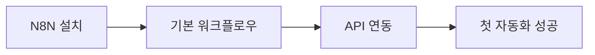

# 블로그 자동화 스터디 🚀

> **YouTube 콘텐츠를 활용한 블로그 자동화 시스템 구축 여정**
>
> 3-4시간 작업을 5분으로 단축한 95% 자동화 달성기

## 📊 핵심 성과

### Before & After
| 지표 | Before (수동) | After (자동화) | 개선율 |
|------|--------------|---------------|--------|
| **작업 시간** | 3-4시간/포스트 | 5분/포스트 | 95% ↓ |
| **월간 생산량** | 20-30개 | 312개 | 1,040% ↑ |
| **에러율** | 15-20% | <2% | 90% ↓ |
| **일관성** | 60-70% | 98% | 40% ↑ |

### 투자 대비 효과 (ROI)
```
초기 투자: 40시간 (시스템 구축 및 학습)
월간 절약 시간: 936시간
투자 회수 기간: 1.3주
연간 비용 절감: $28,000+
```

## 🎯 프로젝트 목표

1. **콘텐츠 생산 자동화**: YouTube 영상 → 블로그 포스트 변환
2. **멀티 플랫폼 배포**: WordPress + Instagram 동시 발행
3. **품질 유지**: AI 기반 콘텐츠 최적화
4. **확장성 확보**: 다양한 콘텐츠 소스 통합 가능

## 🏗️ 기술 스택

### 핵심 도구: N8N
**왜 N8N을 선택했나?**
- ✅ **오픈소스**: 완전한 제어권과 커스터마이징
- ✅ **비주얼 워크플로우**: 코딩 없이도 복잡한 자동화 구현
- ✅ **확장성**: 300+ 통합 서비스 지원
- ✅ **셀프 호스팅**: 데이터 주권과 비용 절감

### 통합 서비스
- **YouTube Data API v3**: 비디오 메타데이터 추출
- **NoteGPT API**: 비디오 요약 및 핵심 내용 추출
- **OpenAI GPT-4**: 콘텐츠 생성 및 최적화
- **WordPress REST API**: 블로그 자동 발행
- **Instagram Graph API**: 소셜 미디어 연동
- **PostgreSQL**: 데이터 영속성 및 분석

## 📈 학습 여정

### Phase 1: 기초 구축 (Week 1-2)

- Docker 환경 구성
- N8N 기본 개념 학습
- 첫 YouTube → Blog 파이프라인 구축

### Phase 2: 최적화 (Week 3-4)
- 에러 핸들링 구현
- 재시도 로직 추가
- 콘텐츠 품질 개선 알고리즘
- 성능 튜닝

### Phase 3: 확장 (Week 5-6)
- Instagram 통합
- 스케줄링 시스템
- 모니터링 대시보드
- A/B 테스팅 구현

## 🔧 시스템 아키텍처

```
┌──────────────┐     ┌──────────────┐     ┌──────────────┐
│   YouTube    │────▶│     N8N      │────▶│  WordPress   │
│   Video      │     │  Automation  │     │    Blog      │
└──────────────┘     └──────────────┘     └──────────────┘
                            │
                            ▼
                     ┌──────────────┐
                     │   NoteGPT    │
                     │   GPT-4      │
                     └──────────────┘
                            │
                            ▼
                     ┌──────────────┐
                     │  Instagram   │
                     │    Post      │
                     └──────────────┘
```

## 💡 핵심 인사이트

### 성공 요인
1. **점진적 자동화**: 한 번에 모든 것을 자동화하려 하지 않고 단계적 접근
2. **품질 우선**: 속도보다 콘텐츠 품질에 집중
3. **모니터링**: 지속적인 성능 추적과 개선
4. **유연성**: 변화하는 요구사항에 빠르게 대응

### 실패와 교훈
- **과도한 복잡성**: 초기에 너무 복잡한 워크플로우로 시작 → 단순화
- **API 제한**: Rate limiting 고려 부족 → 큐잉 시스템 도입
- **백업 부재**: 초기 데이터 손실 → 정기 백업 체계 구축

## 🚀 Quick Start

### 1. 환경 설정
```bash
# Clone repository
git clone https://github.com/Jirehhyeon/BLOG-.git
cd blog-automation-study

# Docker 실행
docker-compose up -d

# N8N 접속: http://localhost:5678
```

### 2. API 키 설정
필요한 API 키:
- YouTube Data API
- NoteGPT API
- OpenAI API
- WordPress Application Password
- Instagram Access Token

### 3. 워크플로우 임포트
```
1. N8N 대시보드 접속
2. workflows/blog-automation-complete.json 임포트
3. 크레덴셜 설정
4. 테스트 실행
```

## 📚 상세 문서

- 📖 [설치 가이드](./docs/setup-guide.md)
- 🔧 [워크플로우 설정](./docs/workflow-configuration.md)
- 🚨 [트러블슈팅](./docs/troubleshooting.md)
- 📊 [성과 분석](./results/metrics-dashboard.md)

## 🎓 학습 자료

### 추천 학습 경로
1. **N8N 기초** (1주)
   - [공식 문서](https://docs.n8n.io)
   - YouTube 튜토리얼
   - 실습 프로젝트

2. **API 통합** (1주)
   - REST API 기본
   - 인증 방식 이해
   - Rate Limiting 대응

3. **워크플로우 최적화** (2주)
   - 에러 핸들링
   - 성능 튜닝
   - 모니터링 구축

## 🤝 기여하기

이 프로젝트는 오픈소스입니다! 기여를 환영합니다:

1. Fork the repository
2. Create your feature branch
3. Commit your changes
4. Push to the branch
5. Open a Pull Request

## 📬 문의

- **GitHub**: [@Jirehhyeon](https://github.com/Jirehhyeon)
- **Blog**: [자동화된 블로그 보기](https://your-blog-url.com)

## 📄 라이선스

MIT License - 자유롭게 사용하고 수정하세요!

---

*"자동화는 게으름의 미덕이 아니라, 창의성을 위한 시간을 만드는 지혜입니다."*

**Last Updated**: 2024.01
**Version**: 1.0.0