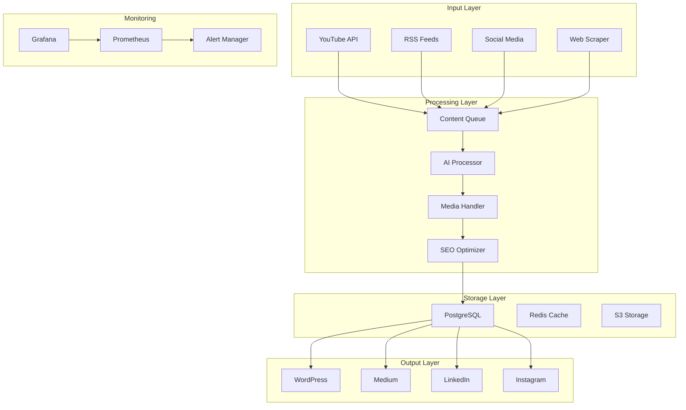

# 🚀 블로그 자동화 실습 프로젝트

## 🔰 초급 프로젝트 (Week 1-2)

### 1. RSS Feed Aggregator
**난이도**: ⭐
**예상 시간**: 2-3시간
**학습 목표**: 
- 기본 워크플로우 이해
- HTTP Request 노드 사용
- 데이터 파싱 및 저장

**구현 기능**:
```yaml
- RSS 피드 5개 수집
- 중복 제거
- 이메일 다이제스트 전송
- CSV 파일 저장
```

### 2. Weather Alert System
**난이도**: ⭐⭐
**예상 시간**: 3-4시간
**학습 목표**:
- API 호출 및 인증
- 조건부 로직 구현
- 알림 시스템 구축

**구현 기능**:
```yaml
- OpenWeather API 연동
- 온도/날씨 조건 체크
- Slack/Email 알림
- 일일 리포트 생성
```

### 3. Social Media Monitor
**난이도**: ⭐⭐
**예상 시간**: 4-5시간
**학습 목표**:
- 멀티 소스 통합
- 데이터 정규화
- 실시간 모니터링

**구현 기능**:
```yaml
- Twitter 멘션 추적
- Instagram 해시태그 모니터링
- 키워드 알림
- 통계 대시보드
```

---

## 🔥 중급 프로젝트 (Week 3-4)

### 1. YouTube Channel Analyzer
**난이도**: ⭐⭐⭐
**예상 시간**: 8-10시간
**학습 목표**:
- YouTube API 마스터
- 데이터 분석 및 시각화
- 리포트 자동 생성

**구현 기능**:
```yaml
입력:
  - YouTube 채널 ID
  
처리:
  - 최근 비디오 분석
  - 조회수/좋아요 통계
  - 트렌드 분석
  - 경쟁 채널 비교
  
출력:
  - PDF 리포트
  - 엑셀 데이터
  - 이메일 전송
```

**샘플 코드**:
```javascript
// 비디오 통계 분석
const videos = $json.items;
const stats = videos.map(v => ({
  title: v.snippet.title,
  views: parseInt(v.statistics.viewCount),
  likes: parseInt(v.statistics.likeCount),
  engagement: (v.statistics.likeCount / v.statistics.viewCount * 100).toFixed(2)
}));

// 평균 계산
const avgViews = stats.reduce((a, b) => a + b.views, 0) / stats.length;
const avgEngagement = stats.reduce((a, b) => a + parseFloat(b.engagement), 0) / stats.length;

return [{
  json: {
    channel_stats: {
      total_videos: stats.length,
      average_views: Math.round(avgViews),
      average_engagement: avgEngagement.toFixed(2),
      top_video: stats.sort((a, b) => b.views - a.views)[0]
    },
    videos: stats
  }
}];
```

### 2. Content Calendar Automation
**난이도**: ⭐⭐⭐⭐
**예상 시간**: 10-12시간
**학습 목표**:
- 스케줄링 시스템
- 콘텐츠 큐 관리
- 멀티 플랫폼 배포

**구현 기능**:
```yaml
기능:
  - Google Calendar 연동
  - 콘텐츠 스케줄링
  - 자동 발행
  - 리마인더 전송
  - 성과 추적

워크플로우:
  1. 캘린더 이벤트 읽기
  2. 콘텐츠 타입 확인
  3. 플랫폼별 포맷 변환
  4. 예약 발행
  5. 결과 리포팅
```

### 3. AI Blog Generator
**난이도**: ⭐⭐⭐⭐
**예상 시간**: 12-15시간
**학습 목표**:
- AI API 통합
- 프롬프트 엔지니어링
- 콘텐츠 최적화

**구현 기능**:
```yaml
파이프라인:
  1. 트렌드 키워드 수집
  2. GPT-4 콘텐츠 생성
  3. 이미지 생성 (DALL-E)
  4. SEO 최적화
  5. WordPress 발행
  6. 소셜 미디어 공유
```

---

## 🚀 고급 프로젝트 (Week 5-6)

### 1. Full Stack Blog Automation Platform
**난이도**: ⭐⭐⭐⭐⭐
**예상 시간**: 20-30시간
**학습 목표**:
- 전체 시스템 구축
- 마이크로서비스 아키텍처
- 프로덕션 레벨 구현

**시스템 아키텍처**:


**핵심 기능**:
```yaml
Content Collection:
  - Multi-source aggregation
  - Duplicate detection
  - Quality filtering
  - Priority queuing

Content Processing:
  - AI summarization
  - Translation (10+ languages)
  - Image optimization
  - Video thumbnail extraction

Publishing:
  - Platform-specific formatting
  - Scheduled posting
  - A/B testing
  - Cross-posting

Analytics:
  - Real-time metrics
  - Performance tracking
  - ROI calculation
  - Predictive analytics

Automation:
  - Self-healing workflows
  - Auto-scaling
  - Intelligent retry
  - Failover mechanisms
```

### 2. Enterprise Content Pipeline
**난이도**: ⭐⭐⭐⭐⭐
**예상 시간**: 30-40시간
**학습 목표**:
- 엔터프라이즈 레벨 구현
- 보안 및 컴플라이언스
- 고가용성 설계

**구현 사항**:
```yaml
Security:
  - OAuth 2.0 / JWT
  - API rate limiting
  - Data encryption
  - Audit logging

Scalability:
  - Load balancing
  - Horizontal scaling
  - Message queuing (RabbitMQ)
  - Caching strategy

Reliability:
  - 99.9% uptime
  - Disaster recovery
  - Backup automation
  - Monitoring & alerting

Compliance:
  - GDPR compliance
  - Content moderation
  - Copyright checking
  - Data retention policies
```

### 3. AI-Powered Content Ecosystem
**난이도**: ⭐⭐⭐⭐⭐
**예상 시간**: 40-50시간
**학습 목표**:
- 머신러닝 통합
- 예측 분석
- 자동 최적화

**AI 기능**:
```python
# 콘텐츠 성과 예측 모델
def predict_content_performance(content_features):
    """
    Features:
    - title_length
    - sentiment_score
    - readability_score
    - keyword_density
    - publish_time
    - category
    """
    model = load_model('content_performance_model.pkl')
    prediction = model.predict(content_features)
    return {
        'expected_views': prediction['views'],
        'expected_engagement': prediction['engagement'],
        'optimal_publish_time': prediction['best_time'],
        'recommended_changes': prediction['suggestions']
    }

# 자동 A/B 테스팅
def automated_ab_testing(content):
    variants = generate_variants(content)
    results = run_multivariate_test(variants)
    return select_best_performer(results)
```

---

## 📊 프로젝트 평가 기준

### 기술적 완성도 (40%)
- [ ] 모든 기능 정상 작동
- [ ] 에러 처리 구현
- [ ] 성능 최적화
- [ ] 코드 품질

### 창의성 (20%)
- [ ] 독창적인 기능
- [ ] 문제 해결 방식
- [ ] UX 개선

### 실용성 (20%)
- [ ] 실제 사용 가능
- [ ] 비즈니스 가치
- [ ] 확장 가능성

### 문서화 (20%)
- [ ] README 완성도
- [ ] 코드 주석
- [ ] API 문서
- [ ] 사용자 가이드

---

## 🎯 프로젝트 선택 가이드

### 학습 목표별 추천
```yaml
API 마스터:
  - YouTube Channel Analyzer
  - Multi-Platform Publisher

자동화 전문:
  - Content Calendar Automation
  - Enterprise Pipeline

AI 활용:
  - AI Blog Generator
  - Content Ecosystem

풀스택:
  - Blog Automation Platform
  - Enterprise Content Pipeline
```

### 시간별 추천
```yaml
주말 프로젝트 (2-3일):
  - RSS Aggregator
  - Weather Alert
  - Social Monitor

1주 프로젝트:
  - YouTube Analyzer
  - Content Calendar

1개월 프로젝트:
  - Full Platform
  - Enterprise Pipeline
```

---

## 💡 프로젝트 팁

### 시작하기 전
1. 요구사항 명확히 정의
2. 기술 스택 결정
3. 일정 계획 수립
4. Git 저장소 생성

### 개발 중
1. 작은 단위로 테스트
2. 정기적으로 커밋
3. 문서 동시 작성
4. 코드 리뷰 요청

### 완료 후
1. 전체 테스트 실행
2. 성능 벤치마크
3. README 최종 정리
4. 데모 영상 제작

---

*🎨 창의적인 프로젝트로 포트폴리오를 완성하세요!*