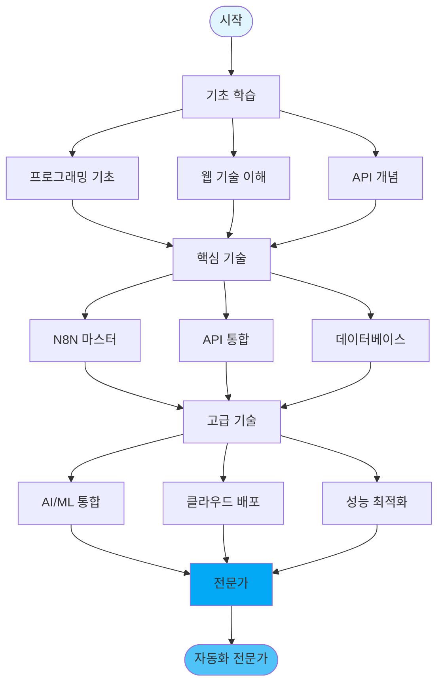

# 🗺️ 블로그 자동화 학습 로드맵

## 🎯 학습 경로 시각화



## 📚 단계별 학습 계획

### 🔷 Phase 1: Foundation (Week 1-2)
**목표**: 기초 지식 습득 및 환경 구축

#### 필수 학습 항목
| 주제 | 학습 시간 | 우선순위 | 완료 |
|------|----------|---------|------|
| JavaScript 기초 | 10h | ⭐⭐⭐⭐⭐ | [ ] |
| REST API 이해 | 5h | ⭐⭐⭐⭐⭐ | [ ] |
| JSON 데이터 구조 | 3h | ⭐⭐⭐⭐⭐ | [ ] |
| HTTP 프로토콜 | 3h | ⭐⭐⭐⭐ | [ ] |
| Docker 기초 | 5h | ⭐⭐⭐⭐ | [ ] |
| Git 버전 관리 | 4h | ⭐⭐⭐⭐ | [ ] |

#### 학습 자료
```yaml
JavaScript:
  - 📖 MDN JavaScript Guide
  - 📹 JavaScript Crash Course (Traversy Media)
  - 🎮 JavaScript30 Challenge

API & HTTP:
  - 📖 RESTful Web Services
  - 📹 REST API Tutorial (Programming with Mosh)
  - 🛠️ Postman Tutorial

Docker:
  - 📖 Docker Official Docs
  - 📹 Docker in 100 Seconds
  - 🎮 Play with Docker
```

#### 실습 과제
```javascript
// 1. JavaScript 기초 - 배열 조작
const videos = [
  { title: "Video 1", views: 1000 },
  { title: "Video 2", views: 5000 },
  { title: "Video 3", views: 3000 }
];

// TODO: 조회수 3000 이상 필터링
// TODO: 제목만 추출
// TODO: 알파벳 순 정렬

// 2. API 호출 실습
async function fetchData() {
  // TODO: fetch로 JSONPlaceholder API 호출
  // TODO: 에러 처리 추가
  // TODO: 데이터 파싱 및 출력
}

// 3. Docker 실습
// TODO: Node.js 앱 컨테이너화
// TODO: docker-compose.yml 작성
// TODO: 볼륨 마운트 설정
```

### 🔷 Phase 2: Core Skills (Week 3-4)
**목표**: N8N 및 자동화 핵심 기술 마스터

#### 필수 학습 항목
| 주제 | 학습 시간 | 우선순위 | 완료 |
|------|----------|---------|------|
| N8N 기초 | 8h | ⭐⭐⭐⭐⭐ | [ ] |
| 워크플로우 설계 | 6h | ⭐⭐⭐⭐⭐ | [ ] |
| 노드 타입 마스터 | 8h | ⭐⭐⭐⭐⭐ | [ ] |
| 에러 처리 | 5h | ⭐⭐⭐⭐ | [ ] |
| 데이터 변환 | 6h | ⭐⭐⭐⭐ | [ ] |
| API 인증 | 4h | ⭐⭐⭐⭐ | [ ] |

#### N8N 학습 체크리스트
```yaml
기초:
  ✅ N8N 설치 및 실행
  ✅ 첫 워크플로우 생성
  ✅ 5가지 노드 타입 사용
  ✅ 트리거 설정

중급:
  ✅ Function 노드 활용
  ✅ 조건부 로직 구현
  ✅ 루프 처리
  ✅ 에러 핸들링

고급:
  ✅ 커스텀 노드 개발
  ✅ 복잡한 데이터 변환
  ✅ 성능 최적화
  ✅ 보안 구현
```

### 🔷 Phase 3: Integration (Week 5)
**목표**: 외부 서비스 통합 및 실전 구현

#### API 통합 마스터
```yaml
YouTube Data API:
  학습시간: 4h
  내용:
    - API 키 발급
    - 채널/비디오 데이터 수집
    - 재생목록 관리
    - 할당량 최적화

OpenAI API:
  학습시간: 6h
  내용:
    - GPT-4 API 활용
    - 프롬프트 엔지니어링
    - 토큰 관리
    - Fine-tuning

WordPress REST API:
  학습시간: 4h
  내용:
    - 인증 설정
    - CRUD 작업
    - 미디어 업로드
    - 커스텀 엔드포인트

Instagram Graph API:
  학습시간: 5h
  내용:
    - 앱 등록
    - 토큰 관리
    - 미디어 포스팅
    - 인사이트 수집
```

### 🔷 Phase 4: Advanced (Week 6+)
**목표**: 프로덕션 레벨 시스템 구축

#### 고급 주제
```yaml
성능 최적화:
  - 캐싱 전략
  - 비동기 처리
  - 부하 분산
  - 리소스 관리

모니터링:
  - Grafana 대시보드
  - Prometheus 메트릭
  - 로그 수집
  - 알림 시스템

보안:
  - API 키 관리
  - 암호화
  - 접근 제어
  - 감사 로그

확장성:
  - 마이크로서비스
  - 메시지 큐
  - 컨테이너 오케스트레이션
  - 자동 스케일링
```

## 🎓 학습 전략

### 효과적인 학습 방법

#### 1. Spaced Repetition (간격 반복)
```
Day 1: 새로운 개념 학습
Day 2: 복습 + 실습
Day 4: 다시 복습
Day 7: 프로젝트 적용
Day 14: 최종 점검
```

#### 2. Active Learning (능동 학습)
```yaml
읽기 (10%): 문서, 블로그
듣기 (20%): 강의, 팟캐스트
보기 (30%): 비디오, 데모
토론 (50%): 커뮤니티, 포럼
실습 (75%): 코딩, 프로젝트
가르치기 (90%): 블로그, 멘토링
```

#### 3. Project-Based Learning
```
Week 1-2: 미니 프로젝트 3개
Week 3-4: 중형 프로젝트 1개
Week 5-6: 실전 프로젝트 1개
```

## 📊 진도 추적

### 주간 목표 설정
```yaml
Week 1:
  월: Docker 환경 구축
  화: JavaScript 기초
  수: REST API 이해
  목: N8N 설치
  금: 첫 워크플로우
  주말: 복습 및 프로젝트

Week 2:
  월: API 인증
  화: 데이터 변환
  수: 에러 처리
  목: YouTube API
  금: 통합 테스트
  주말: 미니 프로젝트
```

### 일일 학습 체크리스트
```markdown
## 오늘의 학습 (날짜: ______)

### 오전 (2시간)
- [ ] 이론 학습: __________
- [ ] 문서 읽기: __________
- [ ] 노트 정리: __________

### 오후 (3시간)
- [ ] 실습 과제: __________
- [ ] 코드 작성: __________
- [ ] 디버깅: __________

### 저녁 (1시간)
- [ ] 복습: __________
- [ ] 내일 계획: __________
- [ ] 커뮤니티 참여: __________

### 성과
- 완료한 작업: __________
- 해결한 문제: __________
- 새로 배운 것: __________
```

## 🏆 마일스톤

### Level 1: Beginner 🥉
```yaml
달성 조건:
  - N8N 설치 완료
  - 5개 워크플로우 생성
  - API 1개 통합
  - 미니 프로젝트 1개

예상 기간: 2주
```

### Level 2: Intermediate 🥈
```yaml
달성 조건:
  - 20개 워크플로우 생성
  - 복잡한 데이터 처리
  - 멀티 API 통합
  - 중형 프로젝트 완성

예상 기간: 4주
```

### Level 3: Advanced 🥇
```yaml
달성 조건:
  - 프로덕션 시스템 구축
  - 성능 최적화 적용
  - 모니터링 구현
  - 실전 프로젝트 운영

예상 기간: 6주
```

### Level 4: Expert 💎
```yaml
달성 조건:
  - 커스텀 노드 개발
  - 오픈소스 기여
  - 커뮤니티 멘토링
  - 자체 플랫폼 구축

예상 기간: 3개월+
```

## 🔗 학습 리소스

### 공식 문서
- [N8N Docs](https://docs.n8n.io)
- [YouTube API](https://developers.google.com/youtube/v3)
- [OpenAI API](https://platform.openai.com/docs)
- [WordPress REST API](https://developer.wordpress.org/rest-api/)

### 추천 강의
```yaml
무료:
  - freeCodeCamp JavaScript
  - N8N YouTube Channel
  - Traversy Media
  - The Net Ninja

유료:
  - Udemy N8N Masterclass
  - Coursera API Design
  - Pluralsight Docker Path
```

### 커뮤니티
- N8N Community Forum
- Reddit r/n8n
- Stack Overflow
- Discord 서버

## 💪 동기부여

### 성공 스토리
```
"3개월 전 코딩을 몰랐던 제가 이제는 
월 300개 포스트를 자동으로 생성합니다."
- 김개발, 블로거

"N8N으로 업무 시간을 80% 단축했습니다.
이제 창의적인 일에 집중할 수 있어요."
- 이자동, 마케터
```

### 격언
> "자동화는 게으름이 아니라 효율성이다"

> "작은 자동화가 모여 큰 변화를 만든다"

> "반복하지 말고 자동화하라"

---

## 🎯 Action Items

### 오늘 시작하기
1. [ ] 학습 로드맵 인쇄/저장
2. [ ] 주간 목표 설정
3. [ ] 학습 환경 구축
4. [ ] 첫 실습 시작

### 이번 주 완료하기
1. [ ] Docker 설치
2. [ ] N8N 실행
3. [ ] 첫 워크플로우
4. [ ] 커뮤니티 가입

### 이번 달 달성하기
1. [ ] 기초 과정 완료
2. [ ] 프로젝트 1개 완성
3. [ ] 블로그 포스트 작성
4. [ ] 포트폴리오 구축

---

*🚀 당신의 자동화 여정을 응원합니다!*