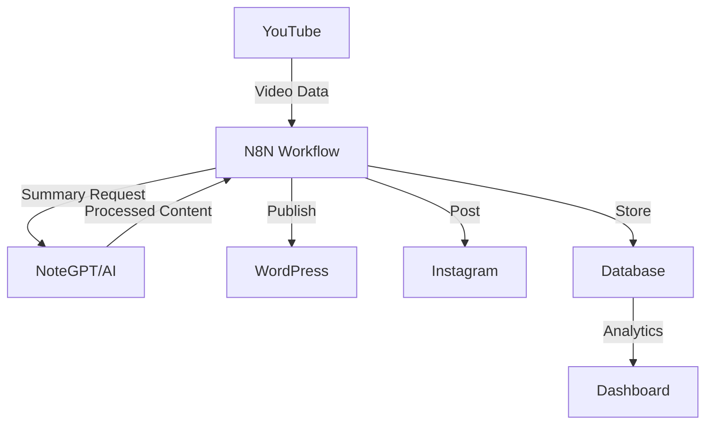

# Week 1: 기초 다지기 - 자동화의 시작 🚀

## 📚 학습 목표
- 워크플로우 자동화의 개념과 필요성 이해
- 개발 환경 구축 완료
- REST API와 JSON 기초 습득
- 프로젝트 아키텍처 설계 능력

## 📅 Day 1: 자동화 개요

### 🎯 학습 내용

#### 1. 워크플로우 자동화란?
```
정의: 반복적인 작업을 자동으로 수행하는 시스템
예시: 이메일 → 스프레드시트 → 슬랙 알림
```

#### 2. 왜 N8N을 선택해야 하는가?

| 특징 | N8N | Zapier | Make.com | OPAL |
|------|-----|--------|----------|------|
| **목적** | 워크플로우 자동화 | 워크플로우 자동화 | 워크플로우 자동화 | 정책 기반 인증 |
| **가격** | 무료 (셀프호스팅) | $19.99/월~ | $9/월~ | 무료 (오픈소스) |
| **커스터마이징** | ⭐⭐⭐⭐⭐ | ⭐⭐ | ⭐⭐⭐ | ⭐⭐⭐⭐ |
| **학습 곡선** | 중간 | 쉬움 | 쉬움 | 어려움 |
| **적합한 용도** | 블로그 자동화 | 간단한 연동 | 비즈니스 자동화 | 권한 관리 |

**결론**: 블로그 자동화에는 N8N이 최적!

#### 3. 자동화 가능한 작업들
- ✅ 콘텐츠 수집 및 큐레이션
- ✅ 데이터 변환 및 처리
- ✅ 멀티 플랫폼 배포
- ✅ 알림 및 리포팅
- ✅ 백업 및 동기화

### 📝 실습: 자동화 기회 찾기

**과제**: 현재 업무에서 자동화 가능한 작업 10개 찾기

```markdown
# 나의 자동화 기회 리스트
1. [ ] 매일 아침 뉴스 요약 받기
2. [ ] 소셜 미디어 동시 포스팅
3. [ ] 이메일 자동 분류
4. [ ] 데이터 백업 스케줄링
5. [ ] 리포트 자동 생성
... (10개까지)
```

### 🔗 참고 자료
- [N8N vs Zapier 상세 비교](https://n8n.io/blog/n8n-vs-zapier/)
- [워크플로우 자동화 입문](https://www.youtube.com/watch?v=example)

---

## 📅 Day 2: 환경 설정

### 🎯 학습 내용

#### 1. Docker 설치 및 이해

**Docker란?**
- 컨테이너 기반 가상화 플랫폼
- "한 번 빌드하면 어디서나 실행"

**설치 과정:**
```bash
# Windows/Mac
1. Docker Desktop 다운로드
2. 설치 후 실행
3. 터미널에서 확인
docker --version

# Linux
curl -fsSL https://get.docker.com -o get-docker.sh
sh get-docker.sh
```

**핵심 명령어:**
```bash
# 이미지 다운로드
docker pull n8nio/n8n

# 컨테이너 실행
docker run -it --rm \
  --name n8n \
  -p 5678:5678 \
  -v ~/.n8n:/home/node/.n8n \
  n8nio/n8n

# 컨테이너 목록 확인
docker ps

# 컨테이너 중지
docker stop n8n
```

#### 2. Git 기초

**필수 명령어:**
```bash
# 초기 설정
git config --global user.name "Your Name"
git config --global user.email "email@example.com"

# 저장소 클론
git clone https://github.com/Jirehhyeon/BLOG-.git

# 기본 작업 흐름
git add .
git commit -m "메시지"
git push origin main
```

#### 3. VS Code 설정

**필수 확장 프로그램:**
- 🔷 Docker
- 🔷 REST Client
- 🔷 JSON Viewer
- 🔷 GitLens
- 🔷 Prettier

### 📝 실습: Hello World 컨테이너

```dockerfile
# Dockerfile 생성
FROM alpine:latest
CMD echo "Hello, Automation World!"
```

```bash
# 빌드 및 실행
docker build -t hello-automation .
docker run hello-automation
```

### ✅ 체크포인트
- [ ] Docker Desktop 설치 완료
- [ ] `docker run hello-world` 성공
- [ ] Git 설치 및 설정 완료
- [ ] VS Code 확장 프로그램 설치
- [ ] 첫 컨테이너 실행 성공

---

## 📅 Day 3: API 기초

### 🎯 학습 내용

#### 1. REST API 개념

```
REST (Representational State Transfer)
- 웹 서비스 설계 아키텍처
- HTTP 프로토콜 기반
- 리소스 중심 설계
```

#### 2. HTTP 메소드

| 메소드 | 용도 | 예시 |
|--------|------|------|
| GET | 조회 | 블로그 포스트 가져오기 |
| POST | 생성 | 새 포스트 작성 |
| PUT | 전체 수정 | 포스트 전체 업데이트 |
| PATCH | 부분 수정 | 제목만 수정 |
| DELETE | 삭제 | 포스트 삭제 |

#### 3. JSON 이해

```json
{
  "post": {
    "id": 1,
    "title": "자동화 시작하기",
    "content": "N8N으로 시작하는...",
    "tags": ["automation", "n8n", "tutorial"],
    "published": true,
    "metadata": {
      "views": 1250,
      "likes": 89
    }
  }
}
```

**JSON 규칙:**
- 키는 항상 큰따옴표
- 값 타입: 문자열, 숫자, 불린, 배열, 객체, null
- 마지막 항목 뒤 쉼표 X

### 📝 실습: Postman으로 API 테스트

**1. JSONPlaceholder 테스트**
```
GET https://jsonplaceholder.typicode.com/posts/1
```

**2. 응답 분석**
```json
{
  "userId": 1,
  "id": 1,
  "title": "sunt aut facere...",
  "body": "quia et suscipit..."
}
```

**3. POST 요청 만들기**
```
POST https://jsonplaceholder.typicode.com/posts
Body:
{
  "title": "My First Post",
  "body": "This is automated!",
  "userId": 1
}
```

### 🛠️ 도구 설정
1. [Postman 다운로드](https://www.postman.com/downloads/)
2. Collection 생성: "Blog Automation APIs"
3. 환경 변수 설정

---

## 📅 Day 4: 프로젝트 구조 설계

### 🎯 학습 내용

#### 1. 시스템 아키텍처



#### 2. 데이터 흐름 설계

```yaml
1. Input Stage:
   - Source: YouTube API
   - Data: Video metadata, transcripts
   - Format: JSON

2. Processing Stage:
   - Tool: NoteGPT + GPT-4
   - Actions: Summarize, Rewrite, Optimize
   - Output: Blog-ready content

3. Distribution Stage:
   - Targets: WordPress, Instagram
   - Format: Platform-specific
   - Scheduling: Immediate or scheduled

4. Monitoring Stage:
   - Metrics: Success rate, timing
   - Storage: PostgreSQL
   - Visualization: Grafana
```

#### 3. 프로젝트 폴더 구조

```
blog-automation/
├── docker/
│   ├── docker-compose.yml
│   └── .env
├── n8n/
│   ├── workflows/
│   └── credentials/
├── scripts/
│   ├── setup.sh
│   └── backup.sh
├── data/
│   └── postgres/
├── monitoring/
│   ├── grafana/
│   └── prometheus/
└── docs/
    ├── API.md
    └── SETUP.md
```

### 📝 실습: 아키텍처 다이어그램 작성

**도구**: draw.io 또는 Mermaid

**과제**: 자신만의 자동화 시스템 다이어그램 그리기
1. 데이터 소스 정의
2. 처리 단계 명시
3. 출력 채널 표시
4. 피드백 루프 추가

---

## 📅 Day 5: 종합 실습 & 복습

### 🎯 미니 프로젝트: RSS to Email

**목표**: RSS 피드를 읽어 이메일로 전송하는 간단한 자동화

#### Step 1: Docker Compose 설정
```yaml
version: '3.8'
services:
  n8n:
    image: n8nio/n8n
    ports:
      - "5678:5678"
    volumes:
      - n8n_data:/home/node/.n8n
    environment:
      - N8N_BASIC_AUTH_ACTIVE=true
      - N8N_BASIC_AUTH_USER=admin
      - N8N_BASIC_AUTH_PASSWORD=password

volumes:
  n8n_data:
```

#### Step 2: 워크플로우 설계
1. RSS Feed 노드 (Trigger)
2. IF 노드 (조건 분기)
3. Email 노드 (Action)

#### Step 3: 테스트 및 디버깅
- RSS 피드 URL 테스트
- 이메일 전송 확인
- 에러 처리 추가

### 📊 주간 성과 측정

**학습 완료 체크리스트:**
- [ ] Docker 기본 명령어 10개 암기
- [ ] REST API CRUD 이해
- [ ] JSON 구조 읽기/쓰기
- [ ] Git 기본 작업 흐름
- [ ] 첫 N8N 워크플로우 생성

**포트폴리오 과제:**
1. GitHub 저장소 생성
2. README.md 작성
3. 학습 노트 정리
4. 미니 프로젝트 코드 업로드

### 🔥 도전 과제

**Advanced Challenge**: Multi-Source Aggregator
- 3개 이상의 RSS 피드 통합
- 중복 제거 로직 구현
- 카테고리별 분류
- 일일 다이제스트 이메일

### 📚 추가 학습 자료

**필독 자료:**
- [Docker 공식 튜토리얼](https://docker.com/get-started)
- [REST API 디자인 가이드](https://restfulapi.net/)
- [JSON 완벽 가이드](https://www.json.org/)

**추천 영상:**
- "Docker in 100 Seconds" - Fireship
- "REST API Crash Course" - Traversy Media
- "Git & GitHub Tutorial" - Programming with Mosh

### 💡 Week 1 핵심 요약

```markdown
✅ 자동화 = 시간 절약 + 일관성 + 확장성
✅ N8N = 오픈소스 + 셀프호스팅 + 무한 커스터마이징
✅ Docker = 어디서나 동일한 환경
✅ API = 서비스 간 소통 창구
✅ JSON = 데이터 교환 표준
```

### 🎯 Week 2 예습

다음 주 학습 내용:
- YouTube Data API v3
- OpenAI GPT-4 API
- WordPress REST API
- API 인증 방식
- Rate Limiting 대응

**사전 준비:**
1. Google Cloud Console 계정 생성
2. OpenAI 계정 생성
3. WordPress 테스트 사이트 준비

---

## 🏆 Week 1 과제 제출

### 제출 항목
1. 자동화 기회 리스트 10개
2. Docker Hello World 스크린샷
3. Postman Collection 내보내기
4. 시스템 아키텍처 다이어그램
5. RSS to Email 워크플로우 JSON

### 제출 방법
```bash
git add week1-assignments/
git commit -m "Week 1 과제 완료"
git push origin main
```

---

*🎉 축하합니다! Week 1을 완료했습니다. 이제 본격적인 API 학습을 시작할 준비가 되었습니다!*