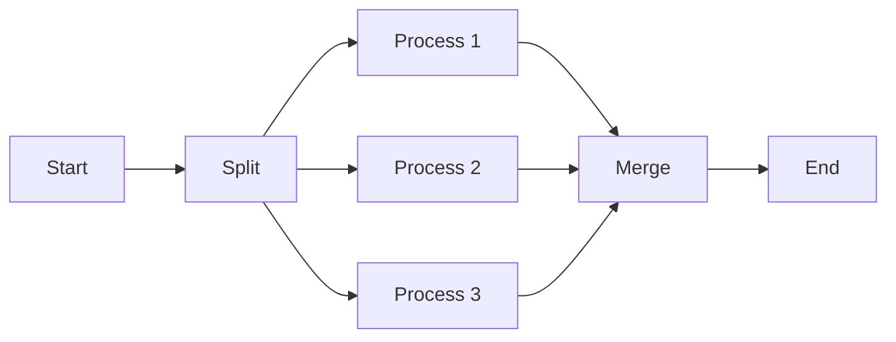
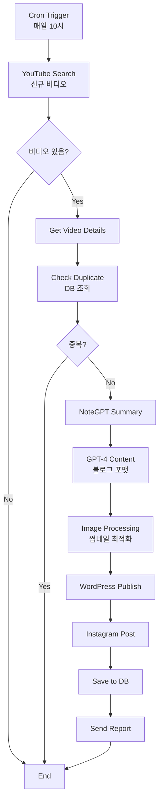

# Week 3: N8N 심화 학습 - 워크플로우 마스터 🔄

## 📚 학습 목표
- N8N 핵심 개념 완벽 이해
- 복잡한 워크플로우 구축 능력
- 에러 처리 및 디버깅 숙달
- YouTube → Blog 파이프라인 완성

## 📅 Day 1: N8N 기초

### 🎯 학습 내용

#### 1. N8N 핵심 개념

**노드(Node)란?**
```
정의: 워크플로우의 기본 구성 단위
역할: 특정 작업을 수행하는 모듈
종류: 트리거, 액션, 데이터 처리
```

**워크플로우(Workflow)란?**
```
정의: 노드들의 연결로 만든 자동화 프로세스
구성: 트리거 → 처리 → 액션
실행: 수동, 스케줄, 이벤트 기반
```

#### 2. 노드 타입 분류

| 카테고리 | 노드 타입 | 용도 | 예시 |
|----------|----------|------|------|
| **Trigger** | Webhook | 외부 이벤트 수신 | API 호출 받기 |
| **Trigger** | Cron | 스케줄 실행 | 매일 9시 실행 |
| **Trigger** | Interval | 주기적 실행 | 5분마다 체크 |
| **Action** | HTTP Request | API 호출 | YouTube API |
| **Action** | Database | DB 작업 | PostgreSQL 저장 |
| **Transform** | Set | 데이터 설정 | 변수 할당 |
| **Transform** | Function | 코드 실행 | JavaScript 처리 |
| **Logic** | IF | 조건 분기 | 조건별 처리 |
| **Logic** | Switch | 다중 분기 | 케이스별 라우팅 |
| **Logic** | Merge | 데이터 병합 | 여러 소스 통합 |

#### 3. 첫 워크플로우 만들기

**Hello World 워크플로우:**
```json
{
  "nodes": [
    {
      "name": "Start",
      "type": "n8n-nodes-base.start",
      "position": [250, 300]
    },
    {
      "name": "Set Message",
      "type": "n8n-nodes-base.set",
      "position": [450, 300],
      "parameters": {
        "values": {
          "string": [
            {
              "name": "message",
              "value": "Hello, N8N World!"
            }
          ]
        }
      }
    }
  ]
}
```

### 📝 실습: 기본 워크플로우 5개 만들기

1. **시간 알림**: 매시 정각 알림
2. **날씨 체크**: 날씨 API 호출
3. **파일 백업**: 폴더 압축 및 저장
4. **이메일 필터**: 조건별 분류
5. **데이터 변환**: JSON → CSV

### 🛠️ N8N 인터페이스 마스터

**필수 단축키:**
- `Ctrl + S`: 저장
- `Ctrl + Enter`: 실행
- `Tab`: 노드 검색
- `Delete`: 노드 삭제
- `Ctrl + D`: 노드 복제

---

## 📅 Day 2: 데이터 처리

### 🎯 학습 내용

#### 1. 데이터 구조 이해

**N8N 데이터 형식:**
```javascript
// 단일 아이템
{
  "json": {
    "name": "John",
    "age": 30
  }
}

// 다중 아이템
[
  { "json": { "id": 1, "title": "Post 1" } },
  { "json": { "id": 2, "title": "Post 2" } }
]
```

#### 2. 데이터 변환 테크닉

**Set 노드 활용:**
```javascript
// 값 설정
{
  "title": "={{$json.videoTitle}}",
  "description": "={{$json.videoDescription}}",
  "publishDate": "={{new Date().toISOString()}}"
}
```

**Function 노드 활용:**
```javascript
// 데이터 가공
for (const item of $input.all()) {
  item.json.processedTitle = item.json.title.toUpperCase();
  item.json.wordCount = item.json.content.split(' ').length;
  item.json.tags = item.json.keywords.split(',').map(k => k.trim());
}

return $input.all();
```

#### 3. 표현식(Expression) 마스터

**자주 사용하는 표현식:**
```javascript
// 이전 노드 데이터 접근
{{$node["HTTP Request"].json.data}}

// 조건부 값
{{$json.status === 'published' ? 'Live' : 'Draft'}}

// 날짜 포맷
{{DateTime.now().toFormat('yyyy-MM-dd')}}

// 문자열 처리
{{$json.title.toLowerCase().replace(' ', '-')}}

// 배열 처리
{{$json.items.map(i => i.name).join(', ')}}
```

### 📝 실습: 복잡한 데이터 변환

**과제: YouTube 데이터 → 블로그 포맷**
```javascript
// Input (YouTube API)
{
  "snippet": {
    "title": "N8N Tutorial",
    "description": "Learn automation...",
    "thumbnails": {
      "high": { "url": "..." }
    }
  },
  "statistics": {
    "viewCount": "1000"
  }
}

// Output (Blog Format)
{
  "post_title": "N8N Tutorial",
  "post_content": "Learn automation...",
  "featured_image": "...",
  "meta": {
    "views": 1000,
    "source": "YouTube"
  }
}
```

---

## 📅 Day 3: 고급 노드

### 🎯 학습 내용

#### 1. Function 노드 심화

**고급 JavaScript 활용:**
```javascript
// 비동기 처리
const axios = require('axios');

async function fetchAdditionalData(url) {
  const response = await axios.get(url);
  return response.data;
}

const items = [];
for (const item of $input.all()) {
  const enrichedData = await fetchAdditionalData(item.json.apiUrl);
  items.push({
    json: {
      ...item.json,
      additional: enrichedData
    }
  });
}

return items;
```

#### 2. Loop 처리

**SplitInBatches 노드:**
```javascript
// 배치 처리 설정
{
  "batchSize": 10,
  "options": {
    "reset": true
  }
}

// 활용 예: 대량 API 호출
// 1000개 아이템 → 100번 × 10개 배치
```

#### 3. 병렬 처리

**동시 실행 패턴:**


### 📝 실습: 복잡한 워크플로우

**Multi-Source Content Aggregator:**
1. YouTube, RSS, Twitter 동시 수집
2. 각 소스별 처리 로직
3. 중복 제거 및 병합
4. 우선순위 정렬
5. 배치 발행

---

## 📅 Day 4: 에러 처리

### 🎯 학습 내용

#### 1. 에러 처리 전략

**Try-Catch 패턴:**
```javascript
// Function 노드에서 에러 처리
try {
  // 위험한 작업
  const result = JSON.parse($json.data);
  return [{ json: result }];
} catch (error) {
  // 에러 처리
  return [{
    json: {
      error: true,
      message: error.message,
      timestamp: new Date().toISOString()
    }
  }];
}
```

#### 2. 에러 워크플로우

**에러 핸들링 노드 구성:**
```
Main Workflow → Error Trigger → Error Handler
                       ↓
                  Notification
                       ↓
                    Logging
                       ↓
                   Recovery
```

#### 3. 재시도 로직

**HTTP Request 재시도 설정:**
```json
{
  "retry": {
    "maxTries": 3,
    "waitBetweenTries": 5000,
    "onError": "continueErrorOutput"
  }
}
```

### 📝 실습: 견고한 워크플로우

**요구사항:**
1. API 호출 실패 시 3회 재시도
2. 실패 시 백업 데이터 사용
3. 에러 로그 저장
4. 관리자 알림 전송
5. 자동 복구 시도

---

## 📅 Day 5: 실전 - YouTube to Blog

### 🎯 최종 프로젝트

#### 완전한 YouTube → Blog 파이프라인

**워크플로우 구조:**


**핵심 노드 설정:**

1. **YouTube 비디오 검색:**
```javascript
// HTTP Request to YouTube API
{
  "url": "https://www.googleapis.com/youtube/v3/search",
  "qs": {
    "part": "snippet",
    "channelId": "{{$credentials.channelId}}",
    "order": "date",
    "maxResults": 5,
    "key": "{{$credentials.apiKey}}"
  }
}
```

2. **콘텐츠 생성 프롬프트:**
```javascript
const prompt = `
YouTube 비디오 정보:
제목: ${$json.title}
설명: ${$json.description}
요약: ${$json.summary}

위 내용을 바탕으로 SEO 최적화된 블로그 포스트를 작성해주세요:
1. 매력적인 제목 (60자 이내)
2. 메타 설명 (160자 이내)
3. 서론 (200자)
4. 본문 (1500자, H2 제목 3개 포함)
5. 결론 (150자)
6. 관련 태그 5개
`;
```

3. **WordPress 발행:**
```javascript
// WordPress REST API
{
  "method": "POST",
  "url": "{{$credentials.wpUrl}}/wp-json/wp/v2/posts",
  "authentication": "basicAuth",
  "body": {
    "title": "={{$json.title}}",
    "content": "={{$json.content}}",
    "status": "publish",
    "categories": [1],
    "tags": "={{$json.tags}}",
    "featured_media": "={{$json.mediaId}}"
  }
}
```

### 📊 성능 최적화

**최적화 포인트:**
1. **캐싱**: 반복 API 호출 감소
2. **배치 처리**: 10개씩 묶어 처리
3. **비동기 실행**: 독립 작업 병렬화
4. **조건 분기**: 불필요한 작업 스킵
5. **에러 격리**: 실패 영향 최소화

### 🧪 테스트 체크리스트

- [ ] 단일 비디오 처리 성공
- [ ] 다중 비디오 배치 처리
- [ ] 중복 체크 작동
- [ ] 에러 발생 시 복구
- [ ] 모든 플랫폼 발행 확인
- [ ] 24시간 연속 작동 테스트

### 📈 모니터링 설정

**추적 메트릭:**
```javascript
// 실행 통계 수집
const metrics = {
  workflow_id: $workflow.id,
  execution_id: $execution.id,
  start_time: $execution.startedAt,
  duration: $execution.duration,
  success: !$execution.error,
  videos_processed: $json.videos.length,
  posts_created: $json.published.length,
  errors: $json.errors || []
};

// DB 저장 또는 모니터링 툴 전송
```

### 🎓 Week 3 학습 성과

**완성된 스킬:**
- ✅ 20+ 노드 타입 활용
- ✅ 복잡한 데이터 변환
- ✅ 에러 처리 구현
- ✅ 실전 워크플로우 구축
- ✅ 성능 최적화 적용

### 🚀 다음 단계

**Week 4 Preview:**
- 고급 통합 패턴
- 스케일링 전략
- 모니터링 구축
- 보안 강화
- 프로덕션 배포

### 📚 추가 학습 자료

**필독 문서:**
- [N8N 공식 문서](https://docs.n8n.io)
- [N8N Community Workflows](https://n8n.io/workflows)
- [JavaScript for N8N](https://docs.n8n.io/code-examples/javascript/)

**추천 프로젝트:**
1. RSS 통합 리더
2. 소셜 미디어 스케줄러
3. 데이터 ETL 파이프라인
4. 모니터링 대시보드
5. 백업 자동화

---

## 🏆 Week 3 최종 과제

### 제출물
1. YouTube → Blog 워크플로우 (JSON)
2. 실행 로그 (24시간)
3. 성능 리포트
4. 에러 처리 문서
5. 개선 제안서

### 평가 기준
- 기능 완성도 (40%)
- 에러 처리 (20%)
- 성능 최적화 (20%)
- 코드 품질 (10%)
- 문서화 (10%)

---

*🎉 축하합니다! N8N 핵심 기능을 마스터했습니다!*